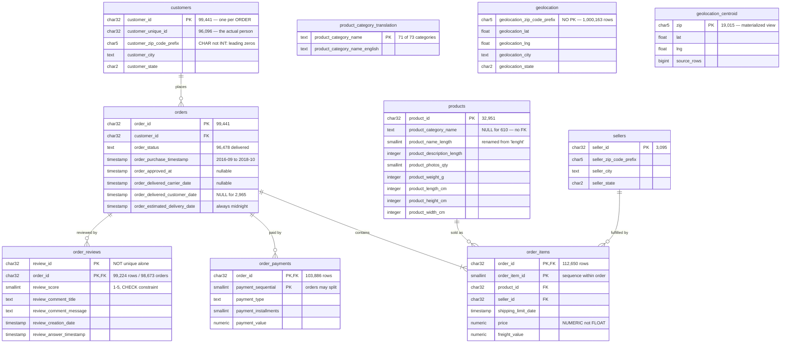

# Entity Relationship Diagram

Generated from the live database catalogue (`information_schema`), so it reflects
what is actually enforced rather than what was intended.

Row counts are from `pg_stat_user_tables` after a full load.

## What the diagram does not show, and why it matters

Three relationships exist in the data but are deliberately **not** enforced as
foreign keys. Each absence is a decision, not an oversight.

**`products.product_category_name` → `product_category_translation`**
Cannot be a foreign key: products reference 73 categories and the lookup covers
71. `pc_gamer` and `portateis_cozinha_e_preparadores_de_alimentos` have no
English name, so the constraint would fail on load. Queries use `LEFT JOIN` +
`COALESCE`; an inner join would silently delete those products' revenue.

**`customers`/`sellers` zip → `geolocation`**
`geolocation` has no unique key to reference — it holds ~53 rows per zip prefix.
Coverage is also incomplete: 476 delivered orders have a zip absent from the
table. Joins go through `geolocation_centroid` instead, which is unique by
construction.

**`geolocation_centroid` is a materialized view, not a table.** It appears here
because queries join it, but it is derived data with no foreign keys of its own.
See `optimization.md` for the measurement that justified it.

## The relationship that causes the most errors

`customers ||--o{ orders` reads as "one customer places many orders", which is
how this schema *looks*. In practice Olist issues a **new `customer_id` for every
order**, so the relationship is effectively 1:1 — 99,441 customers, 99,441
orders.

The real one-to-many is `customer_unique_id → orders`, and that column is not a
key of anything. Grouping by `customer_id` reports every customer as a one-time
buyer with exactly 1.000 orders each. The ERD cannot show this; only the data can.

## Regenerating

This diagram is committed as Mermaid rather than an image so it stays in version
control, diffs meaningfully, and cannot drift from the schema unnoticed. GitHub
renders it natively.

To produce the pgAdmin version instead:

1. Open **pgAdmin 4** (installed at `~/Applications/pgAdmin 4.app`)
2. Register the server: Host `localhost`, Port `5432`, Database `olist`,
   Username `shsapkota`, no password (local trust auth)
3. Right-click the **`olist`** database → **Generate ERD**
4. **File → Save Image** → `docs/erd.png`

Both can coexist; the pgAdmin export shows the same six enforced foreign keys.
